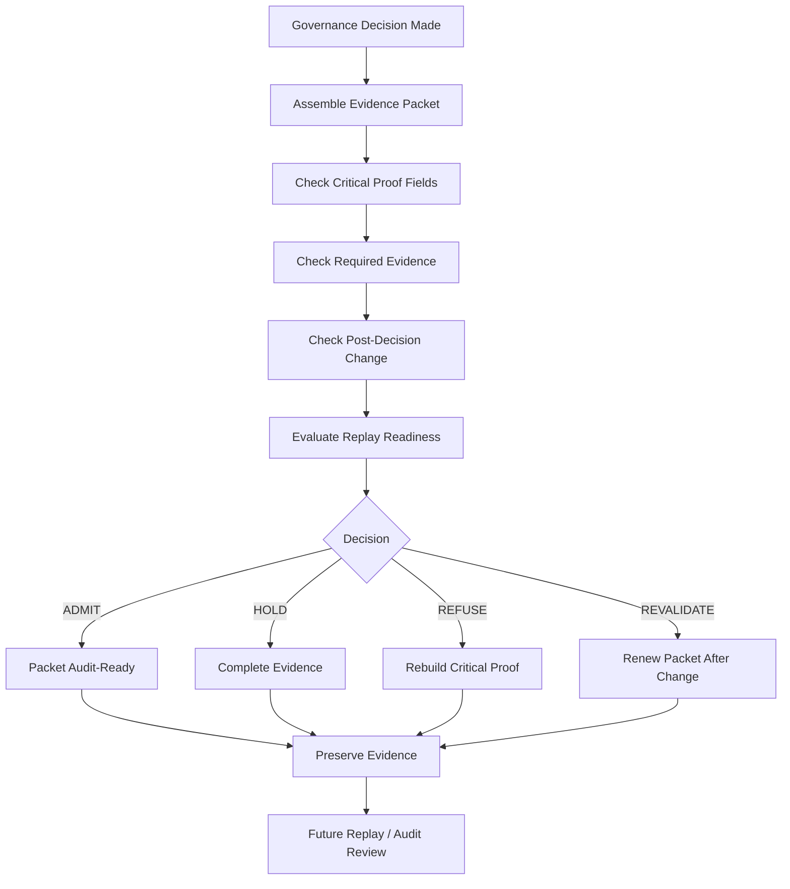

# Architecture Diagram

```mermaid
flowchart TD
    A[Governance Decision Made] --> B[Assemble Evidence Packet]
    B --> C[Check Critical Proof Fields]
    C --> D[Check Required Evidence]
    D --> E[Check Post-Decision Change]
    E --> F[Evaluate Replay Readiness]
    F --> G{Decision}
    G -->|ADMIT| H[Packet Audit-Ready]
    G -->|HOLD| I[Complete Evidence]
    G -->|REFUSE| J[Rebuild Critical Proof]
    G -->|REVALIDATE| K[Renew Packet After Change]
    H --> L[Preserve Evidence]
    I --> L
    J --> L
    K --> L
    L --> M[Future Replay / Audit Review]
```

## Interpretation

The audit evidence pack sits after governance decisions and converts decisions into reviewable evidence packets.
